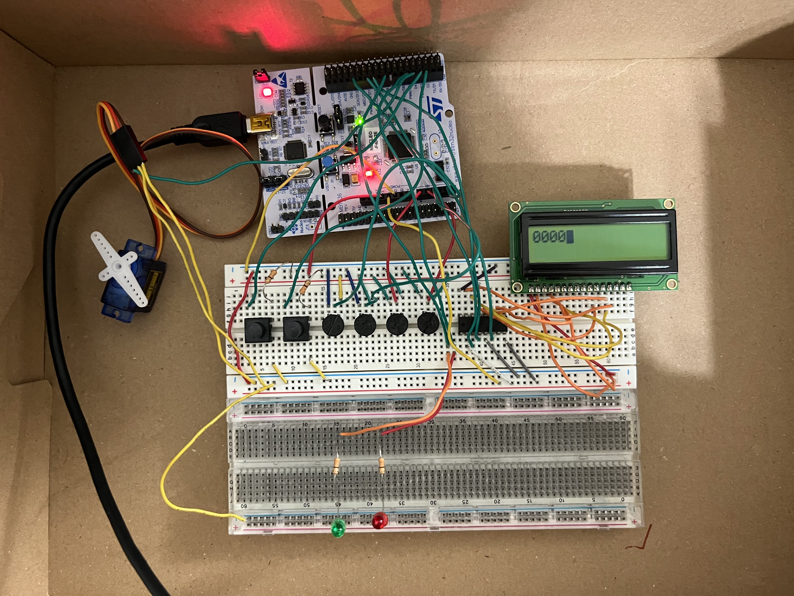
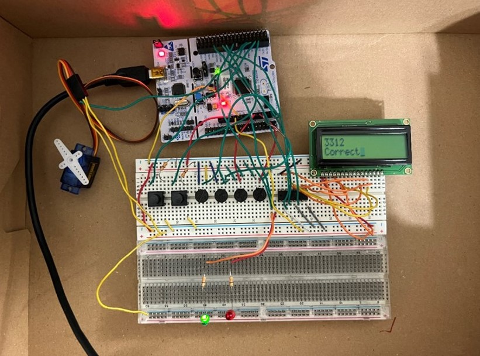
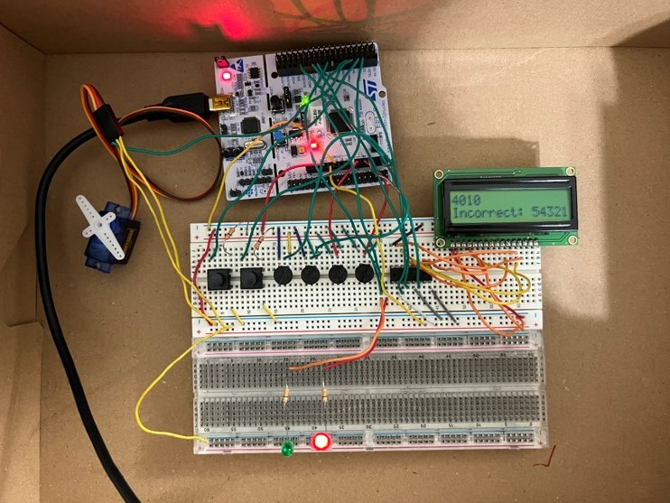
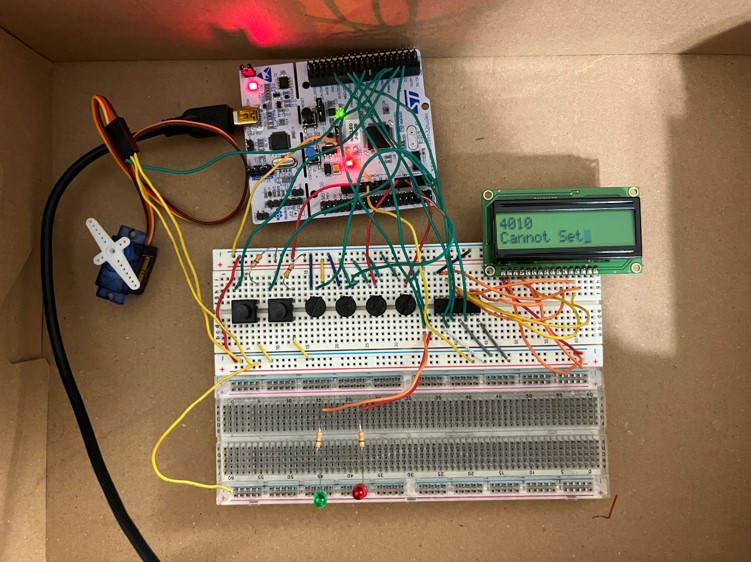

# smart lock System
## overview
This project demonstrates the implementation of a Smart Lock System using potentiometers as input devices to represent a 4-digit combination lock. The lock system allows users to set and validate a combination, providing feedback through an LCD display and LED indicators.

# Features
## 1. 4-Digit Combination
The smart lock uses four potentiometers to adjust the values of the four digits in the combination. Each potentiometer corresponds to an AnalogIn input, allowing the user to adjust the distinct digits of the combination.
The combination is always a 4-digit code.
## 2. Validation Mechanism
The system features a validation mechanism to check if the current combination entered via the potentiometers matches the previously set combination.
LED indicators and an LCD display provide real-time feedback on whether the entered combination is correct or incorrect.
Correct Combination: The system displays a success message and flashes the LED indicator.
Incorrect Combination: The system indicates an error via the LCD and LED.
## 3. Set Mechanism
Before setting a new combination, the user must perform validation to ensure security.
After successful validation, the user can press the Set button to enter a new combination, which triggers the reset Interrupt Service Routine (ISR).
The system switches between two modes:
Validation Mode: Compares the current combination entered with the previously set combination.
Set Mode: Allows the user to set a new combination.
A variable called enterBit is used to track the state of the combination. If enterBit is true, the system checks if the current combination matches the set combination.

## Correct

## Components
### 4 Potentiometers: Used to set the four digits of the combination.
### LCD Display: Displays the current combination and validation messages.
### LED Indicators: Provide visual feedback for correct or incorrect combinations.
### Set Button: Used to switch to Set Mode and enter a new combination.
### Enter Button: Used for validating the current combination against the set combination.
## Set

# How It Works
## Combination Entry:

Adjust the four potentiometers to select the digits for the 4-digit combination.
The LCD display shows the current combination as the potentiometers are adjusted.
## Validation:

Press the Enter button to validate the combination.
If the entered combination matches the set combination, the system indicates success with an LED flash and a message on the LCD.
If incorrect, an error message will appear, and the system will prompt the user to try again.
Setting a New Combination:

After successful validation, press the Set button to enter Set Mode.
Adjust the potentiometers to choose the new 4-digit combination, then press the Enter button to save it.
The system returns to Validation Mode after the new combination is set.

## Incorrect

## Cannot Set

# Future Improvements
Add a time-out feature to block further attempts after multiple incorrect combinations.

Integrate a keypad for alternative combination entry.

Implement remote access via Bluetooth or Wi-Fi to lock/unlock the system.

Add more robust security features such as logging failed attempts.

# License
This project is licensed under the MIT License. See the LICENSE file for more details.

